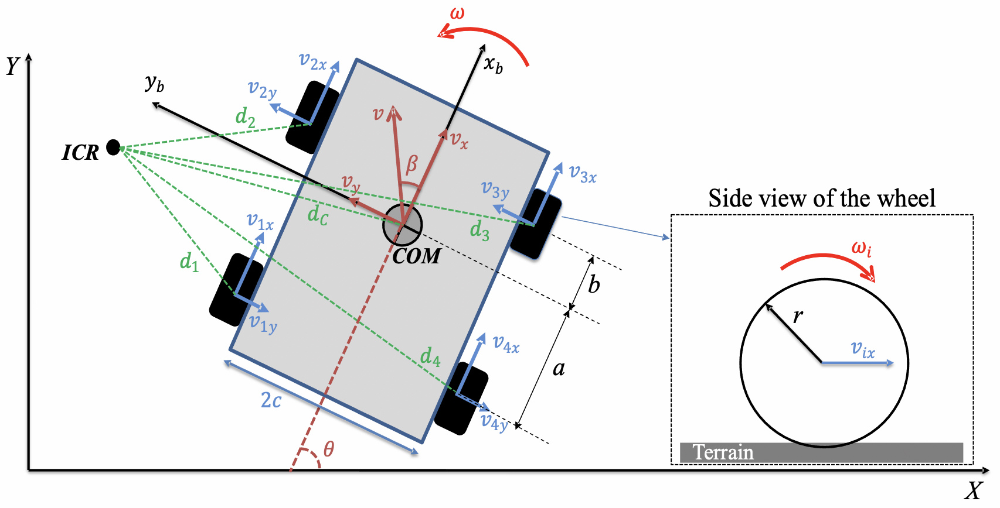

# Sliding-Mode Trajectory Tracking Controller for Skid-Steering Mobile Robots

A pure-Python (no ROS dependency), drop-in sliding-mode controller for
trajectory tracking on skid-steering mobile robots (SSMRs) — e.g. Clearpath
Jackal or Husky, Pioneer 3-AT, AgileX Scout, or any other differential/skid-steered platform.

The control law follows the sliding-mode controller (SMC) described in the
reference paper below. It is robust to the parametric uncertainty inherent
to skid-steering robots (in particular, uncertainty in the location of the
instantaneous centre of rotation), and uses a saturation function instead
of a discontinuous sign function to reduce actuator chattering.

This repository was refactored from a ROS1 (Melodic) node into a
standalone Python package so it can be integrated into any robot stack —
ROS1, ROS2, a custom serial/CAN driver, or a simulator — with a thin
wrapper. See [Migrating from the original ROS1 node](#migrating-from-the-original-ros1-node)
below.



## Contents

- [What this controller does](#what-this-controller-does)
- [Installation](#installation)
- [Quick start](#quick-start)
- [Configuration (`config/default.yaml`)](#configuration-configdefaultyaml)
- [Parameter reference](#parameter-reference)
- [Tuning guidance](#tuning-guidance)
- [Migrating from the original ROS1 node](#migrating-from-the-original-ros1-node)
- [Scope and limitations](#scope-and-limitations)
- [Repository layout](#repository-layout)
- [Reference](#reference)
- [License](#license)

## What this controller does

Given:
- the robot's current pose and velocity (from odometry, an EKF, RTK-GPS, etc.), and
- a desired trajectory (position, heading, and their velocities),

the controller computes a commanded linear velocity `vx_r` and angular
velocity `omega_r` at each control step. It does this by driving two
sliding manifolds (one for the longitudinal error, one for the
lateral/heading error) to zero in finite time, while remaining robust to
uncertainty in the robot's low-level dynamics and in the location of its
instantaneous centre of rotation (ICR) — the parameter that makes
skid-steering robots harder to control than robots with a dedicated
steering mechanism.

This package implements the baseline controller only (referred to as
**SMC** in the paper). The paper also describes an extended version,
**SMC-SS**, which additionally compensates for real-time estimates of
wheel slip and vehicle skidding produced by two deep-learning models. Those
estimators are a separate research contribution and are not included here.
If you have your own slip/skid estimates, you can fold them in yourself —
see [Scope and limitations](#scope-and-limitations).

## Installation

```bash
git clone https://github.com/payam-nourizadeh/skid_steer_sliding_mode_controller
cd sliding-mode-controller
pip install -e .
```

Or, without installing the package, just:

```bash
pip install -r requirements.txt
```

Requires Python ≥ 3.7, `numpy`, and `pyyaml`. `matplotlib` is only needed
for the plotting in `examples/simulate_trajectory.py`.

## Quick start

```python
from smc_controller import SlidingModeController, compute_tracking_error

# Load hyperparameters from config/default.yaml (copy and edit this file
# for your own robot -- see "Parameter reference" below).
controller = SlidingModeController.from_yaml("config/default.yaml")

# --- inside your control loop, once per odometry/localization update ---

# 1. Get the tracking error in the robot's local frame.
error = compute_tracking_error(
    x, y, theta,          # current pose (global frame)
    x_d, y_d, theta_d,    # desired pose at this instant (global frame)
)

# 2. Compute the commanded velocity.
vx_r, omega_r = controller.compute(
    error,
    vx, omega,             # current measured linear/angular velocity
    vx_d, omega_d,         # desired linear/angular velocity
    vx_dot_d, omega_dot_d, # desired linear/angular acceleration (0 if constant)
)

# 3. Send (vx_r, omega_r) to your robot's velocity interface
#    (e.g. publish a geometry_msgs/Twist, or write to your motor driver).
```

A runnable, self-contained example (with a simple simulated robot so you
can see the controller working without hardware) is in
[`examples/simulate_trajectory.py`](examples/simulate_trajectory.py):

```bash
python examples/simulate_trajectory.py --trajectory circular
```

## Configuration (`config/default.yaml`)

All tunable hyperparameters live in a YAML file, loaded with
`SlidingModeController.from_yaml(path)`. Copy `config/default.yaml` and
edit it per-robot; keep the original as a reference. You can also build a
controller directly from a dict (`SlidingModeController.from_dict(...)`)
or from the dataclasses in `smc_controller.controller` if you'd rather
construct it in code.

The defualt.yaml values are based on Clearpath Jackal robot.

```yaml
robot:
  r: 0.09
  robot_width: 0.43
  x0: 0.05
  x0_min: -0.12
  x0_max: 0.15

dynamics:
  c1: 0.26038
  c2: 0.25095
  c3: -0.00049969
  c4: 0.99646
  c5: 0.002629
  c6: 1.0768
  uncertainty_ratio: 0.0

controller:
  landa1: 1.2
  landa2: 2.6
  k1: 6.5
  k2: 9.5
  phi1: 3.5
  phi2: 2.5

limits:
  threshold_vx: 0.4
  threshold_omega: 0.9425
```

## Parameter reference

These are the parameters you'll most likely need to change for your own
hardware:

| Parameter | Section | Meaning |
|---|---|---|
| `r` | `robot` | Wheel effective radius (rolling radius) [m]. |
| `x0` | `robot` | Nominal x-position of the instantaneous centre of rotation (ICR) in the robot's local frame [m]. This is the main source of uncertainty for a skid-steering robot — it shifts with terrain, load, and speed and is not directly measurable. |
| `x0_min`, `x0_max` | `robot` | Lower/upper bounds of the expected ICR range [m] — physically, roughly how far the ICR can wander toward the rear (`x0_min`) or front (`x0_max`) of the robot relative to its centre of mass. These bound the controller's robustness terms and must satisfy `x0_min < x0 < x0_max`. |
| `robot_width` | `robot` | Distance between the left and right wheels' ground contact lines (the paper's `2c`) [m]. |
| `landa1`, `landa2` | `controller` | Sliding-surface (manifold) constants, one per error channel. Must be positive; they act like a proportional gain on the position/heading error inside each sliding surface. Larger values push the error to converge faster but can amplify noise. |
| `k1`, `k2` | `controller` | Robustness gains for the linear/angular velocity channels respectively. These must be large enough to dominate the estimated uncertainty bound on their channel (the controller computes this bound internally as `h1_max`/`h2_max2`) — too small and the controller won't reliably reach the sliding surface; too large and you'll get more aggressive, chattery commands. |
| `phi1`, `phi2` | `controller` | Boundary-layer thickness of the saturation function used in place of `sign()`, one per channel. Larger values smooth out chattering at the cost of some steady-state tracking accuracy; too small brings back chattering. |
| `threshold_vx`, `threshold_omega` | `limits` | Maximum allowed commanded linear [m/s] / angular [rad/s] velocity — set these to your robot's safe operating limits. |

Two additional groups of parameters exist and are also robot-specific, but
were not in the "change this for your hardware" list above because they
usually require a short identification procedure rather than a physical
measurement:

- **`dynamics.c1`–`c6`** — parameters of the robot's low-level
  velocity-tracking dynamics (how `vx`/`omega` respond to the low-level
  controller's commanded velocities). These come from a system
  identification step on your specific robot and drivetrain; the defaults
  here will not be correct for a different robot. `uncertainty_ratio`
  optionally applies a symmetric `±ratio` bound around `c1..c6` (the paper
  suggests ±25%) to make the controller more conservative; `0.0` disables
  this margin.
- **`x0`** itself is also usually found empirically (e.g. by driving the
  robot and comparing commanded vs. observed skidding), rather than
  measured directly from the chassis geometry.

## Tuning guidance

A few practical rules of thumb, derived from the stability analysis in the
reference paper:

- `landa1`, `landa2` must be strictly positive for the sliding manifolds to
  be stable.
- `k1`, `k2` must be large enough to dominate the worst-case uncertainty on
  their respective channel; if the robot doesn't converge onto the desired
  trajectory, try increasing these before touching anything else.
- `phi1`, `phi2` trade off chattering vs. tracking accuracy — start larger
  (smoother, less accurate) and reduce until you see chattering in the
  commanded velocity, then back off slightly.
- Always keep `x0_min < x0 < x0_max`, and keep `x0_min` away from `0` by a
  safe margin — the controller divides by `(x0_min - |e1|)`, so if your
  robot can produce longitudinal tracking errors larger than `|x0_min|`,
  widen `x0_min` accordingly to avoid the controller's internal
  singularity-avoidance bound being violated.

For reference, Table 2 of the paper lists the values used on their
Pioneer 3-AT test platform (different from this repo's Jackal-derived
defaults, and included here only as a second data point):
`x0_max = 0.15`, `x0_min = -0.15`, `landa1 = 1.5`, `landa2 = 1.2`,
`k1 = 5.5`, `k2 = 2.5`, `phi1 = 0.1`, `phi2 = 0.1`,
`threshold_vx = 0.5`, `threshold_omega = 0.3`.

## Migrating from the original ROS1 node

The original implementation was a ROS1 (Melodic) node that combined the
control law with:

- ROS publishers/subscribers for odometry, goals, wheel feedback, and a
  joystick "dead-man's switch",
- a ROS `Trigger` service to gate startup,
- CSV logging tied to the ROS callback, and
- an experimental heading-override branch (`theta_correction`) specific to
  a visual-teach-and-repeat pipeline.

This repository keeps only the reusable control law and error-transform
math, with no ROS dependency. If you want to run it inside ROS1 or ROS2,
write a thin node that:

1. Subscribes to odometry/localization and your goal source,
2. Computes the tracking error with `compute_tracking_error`,
3. Calls `SlidingModeController.compute(...)`, and
4. Publishes the result as a `geometry_msgs/Twist` (or your platform's
   equivalent).

See [`examples/ros_wrapper_example.py`](examples/ros_wrapper_example.py)
for a documented sketch of this pattern for both ROS1 and ROS2. CSV
logging is available as a plain-Python equivalent in
`smc_controller.utils.TrajectoryLogger`, independent of any middleware.

## Scope and limitations

- This package implements the baseline sliding-mode controller (SMC) from
  the paper. It does **not** include the slip/skid deep-learning
  estimators or the SMC-SS compensation terms (paper Eqs. 53–54). If you
  have your own real-time slip ratio (`s_v`) and undesired-skid (`sigma_v`)
  estimates, you can compensate for them before calling this controller,
  by adjusting the commanded velocities as:

  ```text
  vx_corrected    = vx_r / (1 - s_v)
  omega_corrected = omega_r + sigma_v / x0
  ```

  (paper Eqs. 53–54), then send `vx_corrected`/`omega_corrected` to the
  robot instead of the raw controller output.
- The controller assumes a reasonably fast, reliable pose/velocity
  estimate (odometry, EKF, RTK-GPS, etc.) — it does not do any
  localization itself.
- No actuator/motor driver is included; you are responsible for converting
  `(vx_r, omega_r)` into wheel commands for your platform.

## Repository layout

```
.
├── config/
│   └── default.yaml            # hyperparameters (edit per-robot)
├── smc_controller/
│   ├── controller.py           # the sliding-mode control law
│   └── utils.py                # angle wrapping, error transform, YAML/CSV helpers
├── examples/
│   ├── simulate_trajectory.py  # runnable demo with a simulated robot
│   └── ros_wrapper_example.py  # sketch of a ROS1/ROS2 integration
├── tests/
│   └── test_controller.py
├── docs/images/                # add the SSMR schematic figure here
└── pyproject.toml
```

## Reference

The control law implemented here is based on:

> P. Nourizadeh, F. J. Stevens-McFadden, and W. N. Browne,
> "Trajectory Tracking Control for Skid-Steering Mobile Robots with Slip
> and Skid Compensation."
> doi: https://doi.org/10.48550/arXiv.2309.08863

which builds on the authors' earlier slip and skid estimation work:

> P. Nourizadeh, F. J. Stevens McFadden, and W. N. Browne, "In situ slip
> estimation for mobile robots in outdoor environments," *Journal of Field
> Robotics*, vol. 40, no. 3, pp. 467–482, 2023.
> doi: [10.1002/rob.22141](https://doi.org/10.1002/rob.22141)

> P. Nourizadeh, F. J. Stevens-McFadden, and W. N. Browne, "In situ skid
> estimation for mobile robots in outdoor environments," *Journal of Field
> Robotics*, 2023. doi: [10.1002/rob.22252](https://doi.org/10.1002/rob.22252)

If you use this controller in academic work, please cite the paper above.

## License

PolyForm Noncommercial 1.0.0 — free to use, modify, and share for
research, education, and other noncommercial purposes. Commercial use is
not permitted under this license; if you'd like to use this commercially,
please get in touch. Update the Required Notice line at the top of
LICENSE with Payam Nourizadeh and the project URL before publishing.

